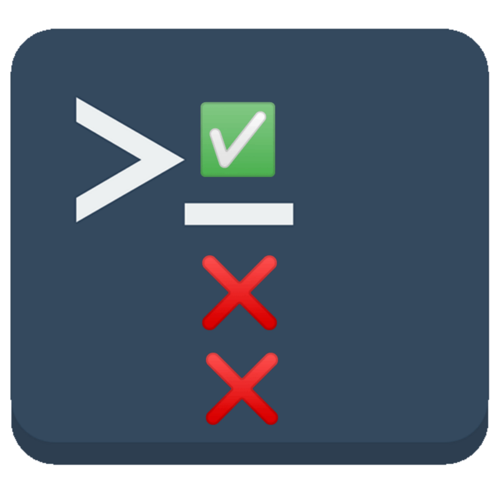
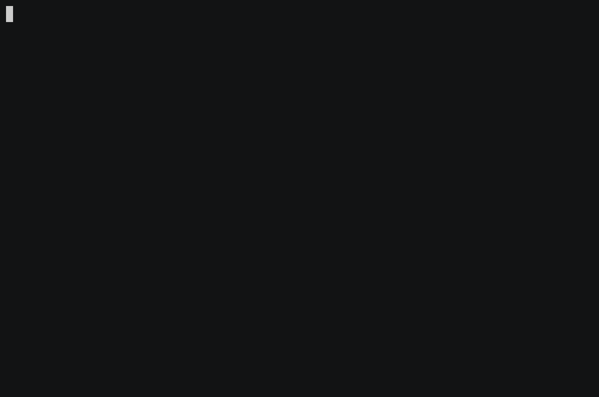
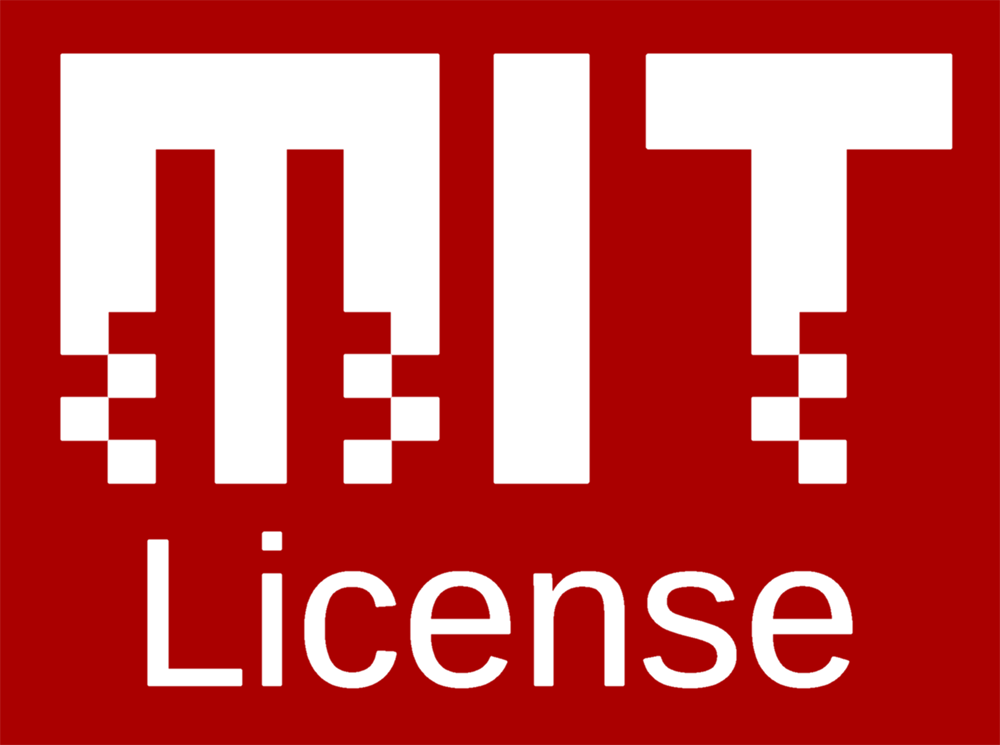

# Tasklist-cli

<p align="center">
  
</p>
[](https://www.npmjs.com/package/tasklist-cli)
[](https://github.com/manojuppala/tasklist-cli/issues)
[](https://www.npmjs.com/package/tasklist-cli)
[](https://github.com/manojuppala/tasklist-cli/blob/main/LICENSE)

Tasklist-cli is a simple and elegant command line application to manage tasks and todos. Tasklist-cli exists to bring all the needed functionalities for simple project management to the terminal. No graphical interface is needed; this tool is easy enough to use to improve your workflow.

## Features

- add todo tasks.
- mark tasks as done.
- add due date to a task.
- revoke done tasks.
- delete all done tasks.

<p>
  
</p>

## Installation

using Node package manager

```shell
npm i tasklist-cli -g
```

you should now be able to use the command `task`

## Usage

you can either use just the task command or task command with a action.

```shell
task
```

```shell
task [action]
```

## Actions

### `add`

- returns a input prompt which takes the input of new task name.

```shell
task add
task a
```

### `list`

- returns the list of all tasks that are incomplete.
- you can either select a task to mark as done or cancel.

```shell
task list
task ls
```

### `done`

- returns the list of all tasks that are marked done.
- you can select a task to revoke and mark as undone.
  or
- you can choose to clear all completed tasks(they will be gone forever).

```shell
task done
task d
```

Read about all the possible commands in [USAGE](https://github.com/manojuppala/tasklist-cli/blob/main/USAGE.md) file.

## Dependencies

- [chalk](https://www.npmjs.com/package/chalk)
- [inquirer](https://www.npmjs.com/package/inquirer)
- [nanospinner](https://www.npmjs.com/package/nanospinner)
- [yargs](https://www.npmjs.com/package/yargs)

## License

```
The files and scripts in this repository are licensed under the MIT License,
which is a very permissive license allowing you to use, modify, copy,
distribute, sell, give away, etc. the software. In other words,
do what you want with it. The only requirement with the MIT License is
that the license and copyright notice must be provided with the software.
```

<a href='https://github.com/manojuppala/todo-list-cli/blob/main/LICENSE'>

</a>
