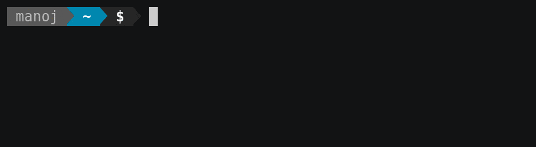

<p align="center">
  
</p>

# Tasklist-cli

[](https://www.npmjs.com/package/tasklist-cli)
[](https://github.com/manojuppala/tasklist-cli/issues)
[](https://www.npmjs.com/package/tasklist-cli)
[](https://github.com/manojuppala/tasklist-cli/blob/main/LICENSE)

Tasklist-cli is a simple and elegant command line application to manage tasks and todos. Tasklist-cli exists to bring all the needed functionalities for simple project management to the terminal. No graphical interface is needed; this tool is easy enough to use to improve your workflow.

## Features

- add todo tasks.
- mark tasks as done.
- revoke done tasks.
- delete done tasks.
- add due date to a task.
- add subtasks to projects.

## Preview

<p>
  
</p>

## Installation

using Node package manager

```shell
npm i tasklist-cli -g
```

you should now be able to use the command `task`

## Usage

you can perform any of the actions listed below.

```shell
task [action] [project_name]
```

## Actions

### `add`

- Adds a new task to default list (or project).

```shell
task add
task a
```

### `list`

- Lists tasks that are marked undone from specified project.

```shell
task list [project_name]
task ls [project_name]
```

### `listdate`

- Lists tasks marked undone along with due date.

```shell
task listdate [project_name]
task ld [project_name]
```

_Note: [project_name] is optional._

### `listproj`

- Lists all available projects.

```shell
task listproj
task lp
```

### `done`

- Lists all the tasks that are marked done.

```shell
task done [project_name]
task d [project_name]
```

Read about all the possible commands in [USAGE](https://github.com/manojuppala/tasklist-cli/blob/main/USAGE.md) file.

## Dependencies

- [chalk](https://www.npmjs.com/package/chalk)
- [inquirer](https://www.npmjs.com/package/inquirer)
- [inquirer-date-prompt](https://www.npmjs.com/package/inquirer-date-prompt)
- [nanospinner](https://www.npmjs.com/package/nanospinner)
- [yargs](https://www.npmjs.com/package/yargs)

|                                                             Author                                                             |
| :----------------------------------------------------------------------------------------------------------------------------: |
| [<br><sub>@manojuppala</sub>](https://github.com/manojuppala) |

## License

```
The files and scripts in this repository are licensed under the MIT License,
which is a very permissive license allowing you to use, modify, copy,
distribute, sell, give away, etc. the software. In other words,
do what you want with it. The only requirement with the MIT License is
that the license and copyright notice must be provided with the software.
```

<a href='https://github.com/manojuppala/todo-list-cli/blob/main/LICENSE'>

</a>
